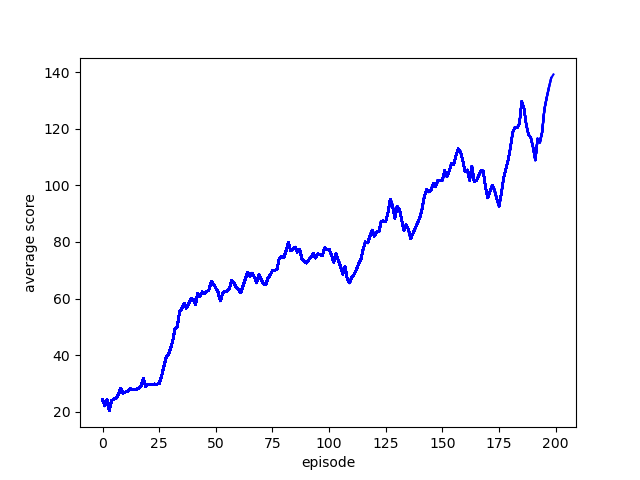

# **Pendulum**

## **Actor-Critic 알고리즘, A2C**
* Actor 네트워크와 Critic 네트워크라는 두 개의 네트워크를 사용한다.
    * **Actor(정책망)**: 각 행동에 대한 확률 분포 **$\pi(a|s)$** 를 반환. 정책망이 어떤 행동을 취해야할지 알려준다.
    * **Critic(가치망)**: 상태의 가치 **$V(s)$** 를 반환, 에이전트의 행동이 예상보다 얼마나 좋을지를 평가한다.
* DQN 과 달리 Actor-Critic 은 Replay Buffer 를 사용하지 않고, 매 step 마다 얻어진 상태(s), 행동(a), 보상(r), 다음 상태(s’)를 이용해서 모델을 학습시킨다.
* DQN 은 Q(s,a)
 값을 얻어내고 Actor-Critic 은 π(s,a)
 값과 V(s)
 값을 구한다. V(s)
 는 가치함수이고, π(s,a)
 는 어떤 상태에서 특정 행동을 취할 확률이다. 보통 이런 확률은 softmax 를 사용해서 얻어낼 수 있다.

### **1. Advantage**
* Actor 의 기대출력으로 예상했던 것(V(s)
)보다 얼마나 더 좋은 값인지를 판단하는 값이다. <br>
$$A(s,a) = Q(s,a) - V(s)$$

### **2. Entropy**
* 어떤 시스템의 불확실성을 측정하는 척도이다. 정책의 엔트로피는 에이전트가 수행할 행동에 대해 얼마나 불확실한지를 보여준다.
* 손실 함수에서 이 엔트로피를 빼 줌으로써 다음 취할 행동에 대하여 너무 확신하고 있는 에이전트에게 패널티를 주어 local minimum에 빠지지 않게 탐색을 계속 시킬 수 있다. <br>
$$H( \pi )=−∑π(a∣s)logπ(a∣s)$$

### **3.1. Loss function - Actor**
$$L_{\pi}=- \frac{1}{n} \displaystyle\sum_{i=0}^{n}[(Q(s_{i},a_{i})-V(s_{i}))\log\pi(a_{i}|s_{i})]$$

### **3.2. Loss function - Critic**
$$L_v=(Q_\pi(s,a)-V_\pi(s))^2$$

<br>

## **Code**

### **1. import**
```python
import numpy as np
import tensorflow as tf
from tensorflow_probability import distributions as tfd
import pylab
import gymnasium as gym
import matplotlib.pyplot as plt
```

### **2. __init__**
```python
class ContinuousA2C:
    def __init__(self, state_size, action_size, max_action):
        self.action_size = action_size
        self.state_size = state_size
        self.max_action = max_action

        self.std_bound = [1e-2, 1.0]
        self.discount_factor = 0.95
        self.actor_learning_rate = 0.0001
        self.critic_learning_rate = 0.001

        self.actor = self.build_actor()
        self.critic = self.build_critic()

        self.actor_optimizer = tf.keras.optimizers.Adam(learning_rate=self.actor_learning_rate)
        self.critic_optimizer = tf.keras.optimizers.Adam(learning_rate=self.critic_learning_rate)
```
* std_bound : action의 표준편차인 sigma를 적당한 크기로 만들어주기 위해 sigma의 최소값과 최대값을 정해준다.

<br>


### **3.1. build - critic**
```python
def build_critic(self):
        critic_input = tf.keras.Input((self.state_size,))
        critic = tf.keras.layers.Dense(64, activation='relu')(critic_input)
        critic = tf.keras.layers.Dense(32, activation='relu')(critic)
        critic = tf.keras.layers.Dense(16, activation='relu')(critic)
        critic_out = tf.keras.layers.Dense(1, activation='linear')(critic) # 상태에 대한 가치 출력

        return tf.keras.Model(critic_input, critic_out) #입력과 출력을 연결하여 critic 모델 생성
```
* 주어진 상태에 대한 가치를 예측하기 위한 critic 모델을 구성

<br>


### **3.2. build - actor**
```python
def build_actor(self):
        actor_input = tf.keras.Input((self.state_size,))
        actor = tf.keras.layers.Dense(64, activation='relu')(actor_input)
        actor = tf.keras.layers.Dense(32, activation='relu')(actor)
        actor = tf.keras.layers.Dense(16, activation='relu')(actor)

        #mu_out는 액션의 평균
        mu_out = tf.keras.layers.Dense(self.action_size, activation='tanh')(actor) 
        mu_out = tf.keras.layers.Lambda(lambda x: x * self.max_action)(mu_out)

        #sigma_out는 액션의 표준편차
        sigma_out = tf.keras.layers.Dense(self.action_size, activation='softplus')(actor) 

        return tf.keras.Model(actor_input, [mu_out, sigma_out]) #입력과 출력을 연결하여 actor 모델 생성
```
* 주어진 상태에 대한 액션의 평균, 표준편차를 출력하기 위한 actor 모델을 구성
1. mu_out(평균) : 액션의 평균을 예측하기 위해 tanh 활성화 함수를 이용해 dense 레이어를 생성한다. tanh 함수는 입력값을 -1부터 1사이의 값으로 매핑해준다. 그리고 self.max_action을 곱함으로써 결론적으로, mu_out은 -self.max_action부터 self.max_action 사이의 값을 가지게 된다. 
2. sigma_out(표준편차) : 액션의 표준편차를 예측하기 위해 softplus 활성화 함수를 이용해 dense 레이어를 생성한다. softplus 함수는 입력값을 양수로 만들어준다.

<br>

### **4. get action**
```python
def get_action(self, state):
        mu, sigma = self.actor(state)
        sigma = tf.clip_by_value(sigma, self.std_bound[0], self.std_bound[1])

        dist = tfd.Normal(loc=mu[0], scale=sigma[0]) 
        action = dist.sample([1])[0]
        
        action = np.clip(action, -self.max_action, self.max_action) 
        
        return action
```
* actor 모델로부터 평균과 표준편차를 받아 mu, sigma에 저장한다. tf.clip_by_value 함수는 텐서의 값을 주어진 최소값과 최대값 사이로 잘라주는 역할을 한다. 표준편차가 최소값인 self.std_bound[0]과 최대값인 self.std_bound[1] 사이의 값이 되도록 한다.
* 평균과 표준편차를 사용하여 정규분포를 만든다. 정규분포를 바탕으로 액션을 선택한다. 그리고 np.clip을 이용해 action의 값을 제한한다. (-2~2)

<br>

### **5. train_model**
```python
 def train_model(self, state, action, reward, next_state, done):
        actor_params = self.actor.trainable_variables 
        critic_params = self.critic.trainable_variables

        next_value = self.critic(next_state) # V(s)
        target = reward + (1 - done) * self.discount_factor * next_value[0] #Q(s,a) 

```
* actor와 critic 모델의 학습 가능한 변수들을 params에 저장한다.
1. V(s) : critic 모델을 통해 next_state의 가치를 예측한다.
2. Q(s,a) : target 가치를 next_state value를 이용해 구한다.

### **5.1. actor_loss**
```python
with tf.GradientTape() as tape1:
            mu, sigma = self.actor(state, training=True) 
            adv = tf.stop_gradient(target - self.critic(state, training=True))
            dist = tfd.Normal(loc=mu, scale=sigma) 
            action_prob = dist.prob([action])[0] #pi(a|s)
            cross_entropy = - tf.math.log(action_prob + 1e-5)
            actor_loss = tf.reduce_mean(cross_entropy * adv)

actor_grads = tape1.gradient(actor_loss, actor_params)
self.actor_optimizer.apply_gradients(zip(actor_grads, actor_params))
```
1. $adv=Q(s,a)-V(s)$ 
2. $action(prob)=\pi(a|s)$
3. $cross(entropy)=-\log\pi(a|s)$ <br>
log 안의 값이 0이 되지 않도록 작은 값인 1e-5를 더해준다.
4. $actor(loss)=- \frac{1}{n} \displaystyle\sum_{i=0}^{n}[(Q(s,a)-V(s))\log\pi(a|s)]$
5. $actor(grads)$ : actor_loss를 actor_params로 미분한 값 <br>
이는 actor 네트워크의 파라미터를 얼마나 조정해야 손실 함수를 최소화할 수 있는지를 알기 위함이다.
6. gradient 값을 변수에 적용하여 actor 네트워크의 파라미터를 업데이트한다.

<br>

### **5.2. critic_loss**
```python
with tf.GradientTape() as tape2:
            value = self.critic(state, training=True) #V(s)
            critic_loss = 0.5 * tf.square(target - value[0])
            critic_loss = tf.reduce_mean(critic_loss)

        #critic_loss에 대한 gradient를 계산한다
        critic_grads = tape2.gradient(critic_loss, critic_params)
        #critic_loss를 이용해 critic을 학습한다
        self.critic_optimizer.apply_gradients(zip(critic_grads, critic_params))

        return actor_loss, critic_loss, sigma

```
1. $value=V(s)$
2. $critic(loss)=0.5\times(Q(s,a)-V(s))^2$
0.5를 곱하는 것은 MSE 손실 함수의 미분 결과를 계산할 때, 제곱 항의 계수인 2와 상쇄되어 미분 결과를 간단하게 만들어 주기 위함이다.
3. $critic(loss)$ 를 평균화해준다. <br>
평균화함으로써 전체 데이터에 대한 손실 값을 얻을 수 있다.
4. $critic(grads)$ : critic_loss를 critic_params로 미분한 값 <br>
이는 critic 네트워크의 파라미터를 얼마나 조정해야 손실 함수를 최소화할 수 있는지를 알기 위함이다.
5. gradient 값을 변수에 적용하여 critic 네트워크의 파라미터를 업데이트한다.

<br>

### **6. weights**
```python
def load_weights(self, path):
        self.actor.load_weights(path + 'pendulum_actor.h5')
        self.critic.load_weights(path + 'pendulum_critic.h5')

    def save_weights(self, path):
        self.actor.save_weights(path + 'pendulum_actor.h5')
        self.critic.save_weights(path + 'pendulum_critic.h5')
```
* 주어진 경로에서 actor 모델과 critic모델의 가중치를 불러와 저장한다.

<br>

### **7. train**
```python
def train(self, env, num_episode=200):
        scores, episodes = [], []
        score_avg = 0

        for e in range(num_episode):
            done = False
            score = 0
            actor_loss_list, critic_loss_list, sigma_list = [], [], []

            #env 초기화
            state, info = env.reset()
            state = np.reshape(state, [1, self.state_size])

```

<br>

### **7.1. train - not done**
```python 
while not done:
    action = self.get_action(state) 
    next_state, reward, term, trunc, info = env.step(action) 
    next_state = np.reshape(next_state, [1, self.state_size]) 

    reward = (reward + 8) / 8 
    done = term or trunc 
    score += reward

    actor_loss, critic_loss, sigma = self.train_model(state, action, reward, next_state, done)
    actor_loss_list.append(actor_loss)
    critic_loss_list.append(critic_loss)
    sigma_list.append(sigma)

    state = next_state 

```
* 현재 state에 대한 action을 선택하고 선택된 action에 대한 next_state, reward, term(종료 여부), trunc(강제 종료 여부), info을 얻는다.
* reward 값이 [-1,1] 범위가 되도록 스케일링한다. 
* state를 업데이트한다.

<br>

### **7.2. train - done**
```python
if done: 
    # score를 업데이트한다
    # 이전 평균 점수를 90%반영하고 현재 에피소드 점수를 10% 반영한다
    score_avg = 0.9 * score_avg + 0.1 * score if score_avg != 0 else score 
    print("episode: {:3d} | score avg: {:3.2f} | actor_loss: {:.3f} | critic_loss: {:.3f} | sigma: {:.3f}".format(e, score_avg, np.mean(actor_loss_list), np.mean(critic_loss_list), np.mean(sigma_list)))

    scores.append(score_avg)
    episodes.append(e)
    pylab.plot(episodes, scores, 'b')
    pylab.xlabel("episode")
    pylab.ylabel("average score")
    pylab.savefig("graph.png")

    if e % 100 == 0:
        self.save_weights('')
```
* score_avg는 이전 평균 점수를 90%반영하고 현재 에피소드 점수를 10% 반영한다.
* episode가 100,200 번째 일 때 모델의 가중치를 저장한다.

<br>

### **8. main**
```python
env = gym.make("Pendulum-v1", render_mode='human')
state_size = env.observation_space.shape[0]
action_size = env.action_space.shape[0]
max_action = env.action_space.high[0]
agent = ContinuousA2C(state_size, action_size, max_action)
agent.train(env)
```

<br>

## **Result**

* 200 episode가 되면 평균 점수가 140점 가까이 되는 것을 볼 수 있다.

<br>

## **소감**
* 앞의 과제는 action이 discrete 하기 때문에 조금은 익숙했지만 본 pendulum 과제는 action이 -2~2로 continuous 해서 처음에는 감조차 잡히지 않았다. 그래서 자료를 검색하던 중 이 과제와 같이 action이 continous한 문제에 A2C라는 방법을 사용하는 예제를 찾을 수 있었다. A2C라는 생소한 방법을 나름 여러 자료를 통해 이해해보려 노력하였다. 기존 공부했왔던 DQN의 범주에서 크게 벗어나지 않아 생각보다 공부하기 수월했던 것 같다. 

<br>


## **Total Code**
```python
import numpy as np
import tensorflow as tf
from tensorflow_probability import distributions as tfd
import pylab
import gymnasium as gym
import matplotlib.pyplot as plt

class ContinuousA2C:
    def __init__(self, state_size, action_size, max_action):
        self.action_size = action_size
        self.state_size = state_size
        self.max_action = max_action

        self.std_bound = [1e-2, 1.0]
        self.discount_factor = 0.95
        self.actor_learning_rate = 0.0001
        self.critic_learning_rate = 0.001

        self.actor = self.build_actor()
        self.critic = self.build_critic()

        self.actor_optimizer = tf.keras.optimizers.Adam(learning_rate=self.actor_learning_rate)
        self.critic_optimizer = tf.keras.optimizers.Adam(learning_rate=self.critic_learning_rate)

    def build_critic(self):
    # 주어진 상태에 대한 가치를 예측한다
        critic_input = tf.keras.Input((self.state_size,))
        critic = tf.keras.layers.Dense(64, activation='relu')(critic_input)
        critic = tf.keras.layers.Dense(32, activation='relu')(critic)
        critic = tf.keras.layers.Dense(16, activation='relu')(critic)
        critic_out = tf.keras.layers.Dense(1, activation='linear')(critic) # 상태에 대한 가치 출력

        return tf.keras.Model(critic_input, critic_out) #입력과 출력을 연결하여 critic 모델 생성

    def build_actor(self):
    # 주어진 상태에 대한 액션의 평균과 표준편차를 출력한다
        actor_input = tf.keras.Input((self.state_size,))
        actor = tf.keras.layers.Dense(64, activation='relu')(actor_input)
        actor = tf.keras.layers.Dense(32, activation='relu')(actor)
        actor = tf.keras.layers.Dense(16, activation='relu')(actor)

        #mu_out는 액션의 평균
        mu_out = tf.keras.layers.Dense(self.action_size, activation='tanh')(actor) # tanh를 사용하여 -1~1사이의 값으로 만든다
        mu_out = tf.keras.layers.Lambda(lambda x: x * self.max_action)(mu_out)

        #sigma_out는 액션의 표준편차
        sigma_out = tf.keras.layers.Dense(self.action_size, activation='softplus')(actor) # softplus를 사용하여 양수로 만든다

        return tf.keras.Model(actor_input, [mu_out, sigma_out]) #입력과 출력을 연결하여 actor 모델 생성

    def get_action(self, state):
    #주어진 상태를 입력으로 받아 액션을 선택한다
        mu, sigma = self.actor(state) #actor 모델로부터 평균과 표준편차를 받는다
        sigma = tf.clip_by_value(sigma, self.std_bound[0], self.std_bound[1]) #표준편차가 너무 작거나 크면 조정한다

        dist = tfd.Normal(loc=mu[0], scale=sigma[0]) #평균과 표준편차를 사용하여 정규분포를 만든다
        action = dist.sample([1])[0]
        #샘플링된 액션을 np.clip을 사용하여 -2~2사이의 값으로 만든다
        action = np.clip(action, -self.max_action, self.max_action) 
        
        return action

    def train_model(self, state, action, reward, next_state, done):
    # 주어진 상태,액션,보상,다음상태,종료 여부를 입력으로 받아 actor와 critic을 학습한다
        actor_params = self.actor.trainable_variables #actor 모델의 변수
        critic_params = self.critic.trainable_variables #critic 모델의 변수

        #다음 상태에서의 가치를 critic을 통해 예측하고 타겟 가치를 계산한다
        next_value = self.critic(next_state) # V(s)
        target = reward + (1 - done) * self.discount_factor * next_value[0] 

        with tf.GradientTape() as tape1:
            #actor_loss 계산
            mu, sigma = self.actor(state, training=True) 
            adv = tf.stop_gradient(target - self.critic(state, training=True))
            dist = tfd.Normal(loc=mu, scale=sigma) 
            action_prob = dist.prob([action])[0] #pi(a|s)
            cross_entropy = - tf.math.log(action_prob + 1e-5)
            actor_loss = tf.reduce_mean(cross_entropy * adv)

        #actor_loss에 대한 gradient를 계산한다
        actor_grads = tape1.gradient(actor_loss, actor_params) #actor_loss에 대한 actor_params의 기울기를 계산한다
        #actor_loss를 이용해 actor를 학습한다
        self.actor_optimizer.apply_gradients(zip(actor_grads, actor_params))

        with tf.GradientTape() as tape2:
            #critic_loss 계산
            value = self.critic(state, training=True) #V(s)
            critic_loss = 0.5 * tf.square(target - value[0])
            critic_loss = tf.reduce_mean(critic_loss)

        #critic_loss에 대한 gradient를 계산한다
        critic_grads = tape2.gradient(critic_loss, critic_params)
        #critic_loss를 이용해 critic을 학습한다
        self.critic_optimizer.apply_gradients(zip(critic_grads, critic_params))

        return actor_loss, critic_loss, sigma

    def load_weights(self, path):
        #주어진 경로에서 actor와 critic의 가중치를 불러온다

        self.actor.load_weights(path + 'pendulum_actor.h5')
        self.critic.load_weights(path + 'pendulum_critic.h5')

    def save_weights(self, path):
        #주어진 경로에 actor와 critic의 가중치를 저장한다

        self.actor.save_weights(path + 'pendulum_actor.h5')
        self.critic.save_weights(path + 'pendulum_critic.h5')

    def train(self, env, num_episode=200):
        scores, episodes = [], []
        score_avg = 0

        for e in range(num_episode):
            done = False
            score = 0
            actor_loss_list, critic_loss_list, sigma_list = [], [], []

            #env 초기화
            state, info = env.reset()
            state = np.reshape(state, [1, self.state_size])

            while not done: #게임이 끝나지 않으면 반복한다
                action = self.get_action(state) #현재 상태에 대해 액션을 선택한다
                next_state, reward, term, trunc, info = env.step(action) 
                next_state = np.reshape(next_state, [1, self.state_size]) #다음 상태를 reshape한다

                
                reward = (reward + 8) / 8 # reward를 스케일링한다
                done = term or trunc #done을 업데이트한다
                score += reward

                # actor와 critic을 학습하고 loss와 표준편차를 얻는다
                actor_loss, critic_loss, sigma = self.train_model(state, action, reward, next_state, done)
                actor_loss_list.append(actor_loss)
                critic_loss_list.append(critic_loss)
                sigma_list.append(sigma)

                state = next_state #상태를 업데이트한다

                

                if done: #게임이 끝나면

                    # score를 업데이트한다
                    # 이전 평균 점수를 90%반영하고 현재 에피소드 점수를 10% 반영한다
                    score_avg = 0.9 * score_avg + 0.1 * score if score_avg != 0 else score 
                    print("episode: {:3d} | score avg: {:3.2f} | actor_loss: {:.3f} | critic_loss: {:.3f} | sigma: {:.3f}".format(
                        e, score_avg, np.mean(actor_loss_list), np.mean(critic_loss_list), np.mean(sigma_list)))

                    scores.append(score_avg)
                    episodes.append(e)
                    pylab.plot(episodes, scores, 'b')
                    pylab.xlabel("episode")
                    pylab.ylabel("average score")
                    pylab.savefig("graph.png")

                

                    if e % 100 == 0:
                        self.save_weights('')
            
            plt.plot(episodes, scores, 'b') 
        plt.show()
    
    
env = gym.make("Pendulum-v1", render_mode='human')
state_size = env.observation_space.shape[0]
action_size = env.action_space.shape[0]
max_action = env.action_space.high[0]
agent = ContinuousA2C(state_size, action_size, max_action)
#agent.load_weights('')
agent.train(env)
```
